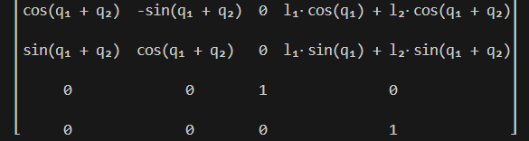
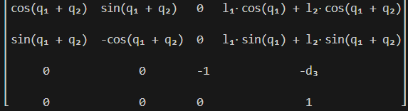

# Introducción

Este proyecto implementa la cinemática directa de robots articualdos utilizando el método de Denavit-Hartenberg (DH) en Python. El objetivo es proporcionar herramientas simbólicas para analizar y simular la posición y orientación del efector final de diferentes robots, facilitando el estudio y la enseñanza de la robótica industrial.

# Metodología

La cinemática directa se implementó mediante la parametrización DH, que permite describir la geometría de cada eslabón y articulación de un robot a través de cuatro parámetros: $\theta$, $d$, $a$, y $\alpha$. El proyecto Se desarrolló a partir de la clase `ForwardKinematicsDH` que ofrece métodos para calcular la matriz homogénea de transformación de manera numérica (usando NumPy) y simbólica (usando SymPy).

El archivo `Matrix_calculus.py` ejemplifica el uso de la clase `ForwardKinematicsDH` para calcular la cinemática directa de diferentes robots: un robot planar RR, un robot antropomórfico RRR y un robot SCARA RRP. En este archivo se definen las tablas DH para cada robot y se obtiene la matriz homogénea simbólica correspondiente, mostrando la versatilidad de la implementación.

Se analizaron los siguientes robots:

- **Robot Planar RR**: Dos articulaciones rotacionales en el plano. 
 

- **Robot Antropomórfico RRR**: Tres articulaciones rotacionales, común en brazos robóticos industriales. 
 

- **Robot SCARA (RRP)**: Dos articulaciones rotacionales y una prismática, típico en aplicaciones pick-and-place. 
 

# Resultados

Los resultados obtenidos incluyen las matrices homogéneas de transformación para cada robot, en forma simbólica. Además, se observó que la elección de los parámetros DH y la asignación de los sistemas de referencia influyen directamente en la forma final de la matriz de transformación.

- **Robot Planar RR**

- **Robot Antropomórfico RRR**

- **Robot SCARA (RRP)**

